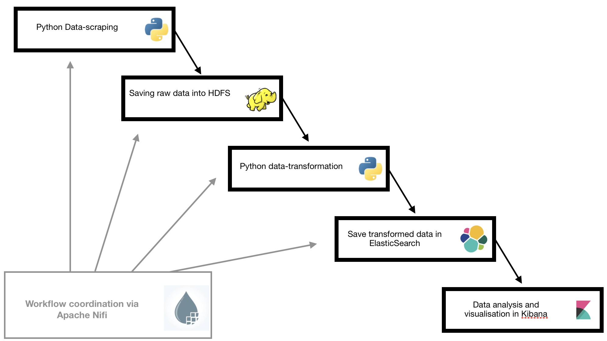

# Media Analysis Pipeline

## Summary

Our Capstone Project called "Media Analysis Pipeline" is used to collect various newspapers articles and store them for analysis. 
The pipeline consists of various technologies, all of which run in containerized environments. The containers are managed by Docker. 

| Magazines scraped and saved as rawdata | Transformer available |
| :---                                   |      :---:            |
| [Die Presse](https://diepresse.com)    | ✔️
| [Kronen Zeitung](https://www.krone.at) | ✔️
| [Unzensuriert.at](https://www.unzensuriert.at) | ✔️
| [Kurier](https://kurier.at)            | 


#### Deployment
The minimum deployment consists of:
- one HDFS namenode
- one HDFS datanode
- one Apache zookeeper 
- one Apache Nifi instance
- two ElasticSearch container
- one Kibana container
- one Hue container


#### Workflow
All of the workflow for getting the data, transforming it, saving raw data as well as transformed and finally storing it in ElasticSearch for analysis, is managed by Apache Nifi.




## Usage

__Run:__
```
docker-compose up
```
Then run `hdfs_conf_script.sh` to copy HDFS config files from the namenode to Nifi. This is only necessary the first time you start the containers.

__First time ElasticSearch script configuration:__

Finally to get ElasticSearch to work just run: 
```
sysctl -w vm.max_map_count=262144
```
(also found in `elsearch_setup.sh`)

__ElasticSearch script for OS X users:__

````
screen ~/Library/Containers/com.docker.docker/Data/com.docker.driver.amd64-linux/tty
````

Press Enter and then:

```
sysctl -w vm.max_map_count=262144
```
This has to be done after every reboot

__Adapt Workflow__

To edit or start the current workflow simple open Nifi in your browser. 
To get NiFis port, simply run:
```
docker ps
```

Then open `localhost:<NIFIPORT>/home`. Inside of Nifi you can import the provided workflow.

## Project Structure

__Files__

This project uses a simple filestructure. 
The folder `etc` contains everything that is not directly assoicated with the deployment (e.g. pictures used in this README).
All files containing code are located in the folder `src`. In `src` files are devided in either `scrapper` or `transformer`.
The folder `nifi` contains all files necessary for the custom Nifi container to run. 

__HDFS__

As mentioned earlier, all of the data gets saved in raw format (complete HTML of the website) to a HDFS Filesystem. This consists of:
- namenode(s) 
    - responsible for orchestrating datanodes
- datanode(s):
    - responsible for actaully saving the data

All files are saved in a common schema:

`magazineName-year-month` 

## Python Scripts

To scrape and transform the articles, we use Python. For this purpose we have a simple class structure. 
First to get the URLs which we want to scrape, we use a class called Newsfeed. This is the base class and every news outlet has it's specialised class which inheritates from it. 


With the URLs at hand we can start scraping. For the scraper we use the same structure as for the Newsfeed scraper. 


Finally all of the data needs to be transformed, so that it can be easily analysed. 
