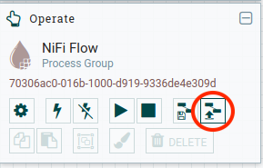
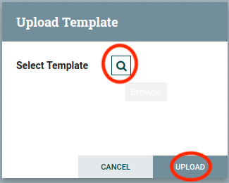
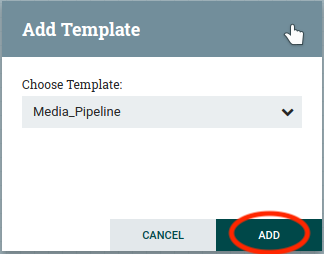

# Media Analysis Pipeline

## Executive Summary

Our Capstone Project called "Media Analysis Pipeline" is used to collect various newspapers articles and store them for analysis. 
The pipeline consists of various technologies, all of which run in containerized environments. The containers are managed by Docker and specified in `docker-compose.yml`. 


Magazines scraped and saved as rawdata | Transformer available
:---                                   |      :---:           
[Die Presse](https://diepresse.com)    | ✔️
[Kronen Zeitung](https://www.krone.at) | ✔️
[Unzensuriert.at](https://www.unzensuriert.at) | ✔️
[Kurier](https://kurier.at)            | 


### Deployment

The minimum deployment consists of following containers:<br><ul class='normal'><li>One Apache Zookeeper</li><li>One Apache NiFi</li><li>One HDFS namenode</li><li>One HDFS datanode</li><li>One Hue</li><li>Two ElasticSearch Nodes</li><li>One Kibana</li></ul> | 
:-- | :--


### Workflow
All of the workflow for getting the data, transforming it, saving raw data as well as transformed and finally storing it in ElasticSearch for analysis, is managed by Apache Nifi.


### Usage

__Ensure ElasticSearch will work__

ElasticSearch needs more memory to store its inidices. Therefore the [mmap counts](https://www.elastic.co/guide/en/elasticsearch/reference/current/vm-max-map-count.html) needs to be increased.
To do so simply run following shell command(s), depending on your OS:

Linux | OS X 
:--- | :---
`sudo sysctl -w vm.max_map_count=262144` | `screen ~/Library/Containers/com.docker.docker/Data/com.docker.driver.amd64-linux/tty ` <br> `sudo sysctl -w vm.max_map_count=262144`
Or execute `elsearch_setup.sh`|

This has to be done after every reboot of the docker host machine.


__Run__

To start all docker containers simultaneously run this: `docker-compose up`

Then run `hdfs_conf_script.sh` to copy HDFS config files from the namenode to Nifi. This is only necessary the first time you start the containers.


__Import Workflow__

To edit or start the current workflow open Nifi in your browser. 
Get NiFi port by running: `docker ps | grep nifi` and open `localhost:<NIFIPORT>/nifi` in your browser.


Step | Image | Step | Image
:--- | :---: | :--- | :---:
1. Select `upload template` on the left side of the screen. |  | 2. Select the template, which is located in `./nifi/templates` and click `Upload`. || 
3. Insert the template via the button in the top menu bar.|| 4. Click `Add`||
5. Click somewhere on the background of NiFi and Click the `Play` button to start the whole workflow|| 6. See the workflow running!

__Hue__

To see the data stored in the HDFS open your browser and navigagte to `localhost:8088/home`. The first time you open it you have to specify an username and a password. Click `File Browser` on the top right corner and go two level up in the folder hierchachy to view the different magazine folders.
From there you can browse the data. 


__Kibana__

The project already contains a Kibana objects file, which contains the index patterns, visualizations and dashboard. To import it you have to do following steps:

* Open Kibana on `localhost:5601` in your browser
* On the left menu bar open settings (last one)
* Click `Saved Objects` on lower menu
* Click `Import` on top right corner
* Click `Import` again
* Open `./kibana/objects.json`
* Click lower `Import` button

Now you can click `Dashboard` on the left menu bar and select the dashboard `Online Magazines` which you've just imported to view the data.


## Documentation

### Project Structure

__Files__

This project uses a simple filestructure. 
The folder `etc` contains everything that is not directly associated with the deployment (e.g. pictures used in this README).
All files containing code are located in the folder `src`. In `src` files are devided in either `scrapper` or `transformer`.
The folder `nifi` contains all files necessary for the custom Nifi container to run. 

### Setup

__Ensure ElasticSearch will work__

ElasticSearch needs more memory to store its inidices. Therefore the [mmap counts](https://www.elastic.co/guide/en/elasticsearch/reference/current/vm-max-map-count.html) needs to be increased.
To do so simply run following shell command(s), depending on your OS:

Linux | OS X 
:--- | :---
`sudo sysctl -w vm.max_map_count=262144` | `screen ~/Library/Containers/com.docker.docker/Data/com.docker.driver.amd64-linux/tty ` <br> `sudo sysctl -w vm.max_map_count=262144`
Or execute `elsearch_setup.sh`|

This has to be done after every reboot of the docker host machine.


__Run__

To start all docker containers simultaneously run this:
```bash
docker-compose up
```
Then run `hdfs_conf_script.sh` to copy HDFS config files from the namenode to Nifi. This is only necessary the first time you start the containers.


__Import Workflow__

To edit or start the current workflow open Nifi in your browser. 
Get NiFis port by runnning `docker ps | grep nifi` and open `localhost:<NIFIPORT>/nifi` in your browser.


|Step | Image | Step | Image |
|:--- | :---: | :--- | :---: |
|1. Select `upload template` on the left side of the screen. |  | 2. Select the template, which is located in `./nifi/templates` and click `Upload`. | | 
|3. Insert the template via the button in the top menu bar.|| 4. Click `Add`||
|5. Click somewhere on the background of NiFi and Click the `Play` button to start the whole workflow|| 6. See the workflow running! |


### Python Scripts

To scrape and transform the articles, we use Python 3.7. 
Libraries which are used:
* request
* beautifulsoup4
 
`Request` is used to download the articles from an url and `BeautifulSoup` for parsing the HTML.
For local development [Pipenv](https://docs.pipenv.org/en/latest/) is used. Execute this commands to get it up and running:

__Install Pipenv__
Linux:
```bash
# Debian/Ubuntu
sudo apt install pipenv
# fedora
sudo dnf install pipenv
```
OS X:
```bash
brew install pipenv
```

Install dependencies and get into the newly created virtual environment:
```bash
pipenv install
pipenv shell
```

###Class diagrams

First to get the URLs which we want to scrape, we use a class called `Newsfeed`. This is the base class and every news outlet has it's specialised class which inheritates from it. 


With the URLs at hand we can start scraping. For the scraper we use the same structure as for the Newsfeed scraper. In this case the base class is called `BaseArticle`.


Finally all of the data needs to be transformed, so that it can be easily analysed. For this, again, we have a base class called `BaseTransfomer`and subclasses for ever outlet.


### HDFS

As mentioned earlier, all of the data gets saved in raw format (complete HTML of the website) to a hadoop filesystem  in a json file (HDFS). This consists of:
* namenode(s) 
    * responsible for orchestrating datanodes
* datanode(s):
    * responsible for actually saving the data

All files are saved in a common directory hierachy: `magazineName/year/month/` 
The articles itself are saved in JSON files with this name schema: `articleId-published_date.json`
The JSON files have this data forma:
```json
{
    "id": "<Value>",
    "magazine": "<Value>",
    "directory": "<Value>",
    "filename": "<Value>",
    "content": "<Value>"
}
```

The content attribute is where the actual article HTML belong to.

__Hue__

To see the data stored in the HDFS open your browser and navigagte to `localhost:8088/home`. The first time you open it you have to specify an username and a password.
Click `File Browser` on the top right corner and go two level up in the folder hierchachy to view the different magazine folders.
From there you can browse the data. 


### ElasticSearch

ElasticSearch is available on `localhost:9200`. The ElasticSearch cluster consists of two nodes, which are specified in the `docker-compose.yml` file.

__Data format__
Indices schema: `magazineName-month-year`
```json
{
    "id": "<Value>",
    "title": "<Value>",
    "ressorts": "<Value>",
    "published_time": "<Value>",
    "modified_time": "<Value>",
    "url": "<Value>",
    "author": "<Value>",
    "are_comments_allowed": "<Value>",
    "tags": "<Value>",
    "article_text": "<Value>",
    "is_plus": "<Value>"
}
```

### Kibana

Kibana is used to visualize the data which is stored in ElasticSearch.
Open `localhost:5601` in your browser to view kibana.

The project already contains a Kibana objects file, which contains the index patterns, visualizations and dashboard. To import it you have to do following steps:

* Open Kibana on `localhost:5601` in your browser
* On the left menu bar open settings (last one)
* Click `Saved Objects` on lower menu
* Click `Import` on top right corner
* Click `Import` again
* Open `./kibana/objects.json`
* Click lower `Import` button

Now you can click `Dashboard` on the left menu bar and select the dashboard `Online Magazines` which you've just imported to view the data.

